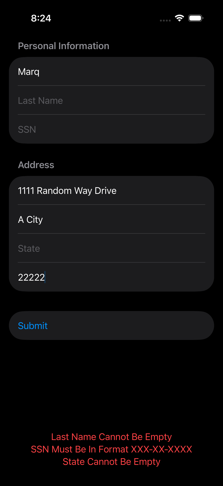
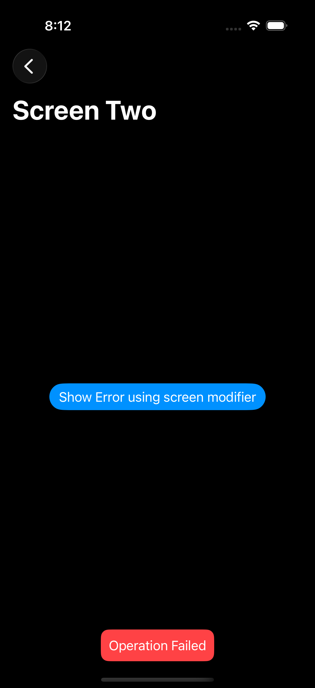

## Overview

This repository is a dedicated practice application designed to master advanced SwiftUI architecture and robust state management. The project serves as a deep dive into scalable app configuration, focusing on clean code principles and a seamless user experience.

### Key Learning Objectives

* **State Management:** Implementation of `EnvironmentObjects` and custom `EnvironmentKeys` for streamlined data flow.
* **Error Handling:** A robust, global error-handling system featuring centralized logic and coordinated UI popups.
* **View Configuration:** Advanced view setup and modular UI composition.
* **Localization:** Full support for multi-language strings and internationalization best practices.
* **Form Validation:** Real-time logic for user input validation and error feedback.

---

### Project Highlights

The core of this project explores **Global Error Handling**. By leveraging custom `EnvironmentKeys`, the app can trigger synchronized error alerts from anywhere in the view hierarchy without redundant code.

  
